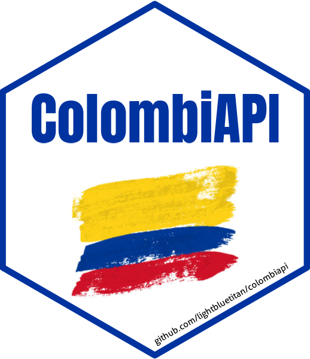

# ColombiAPI: Access Colombian Data via APIs and Curated Datasets

This package provides a comprehensive interface to access diverse public
data about Colombia through multiple APIs and curated datasets. The
package integrates four different APIs: API-Colombia for
Colombian-specific data including geography, culture, tourism, and
government information; World Bank API for economic and demographic
indicators; Nager.Date for public holidays; and REST Countries API for
general country information. Additionally, ColombiAPI includes curated
datasets covering Bogota air stations, business and holiday dates,
public schools, Colombian coffee exports, cannabis licenses, Medellin
rainfall, malls in Bogota, as well as datasets on indigenous languages,
student admissions and school statistics, forest liana mortality and
more.

## Details

ColombiAPI: Access Colombian Data via APIs and Curated Datasets

Access Colombian Data via APIs and Curated Datasets.

## See also

Useful links:

- <https://github.com/lightbluetitan/colombiapi>

## Author

**Maintainer**: Renzo Caceres Rossi <arenzocaceresrossi@gmail.com>
